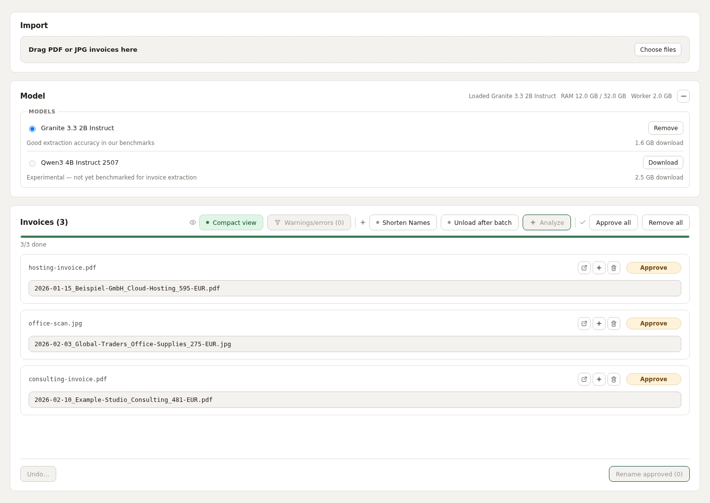
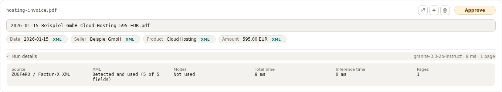
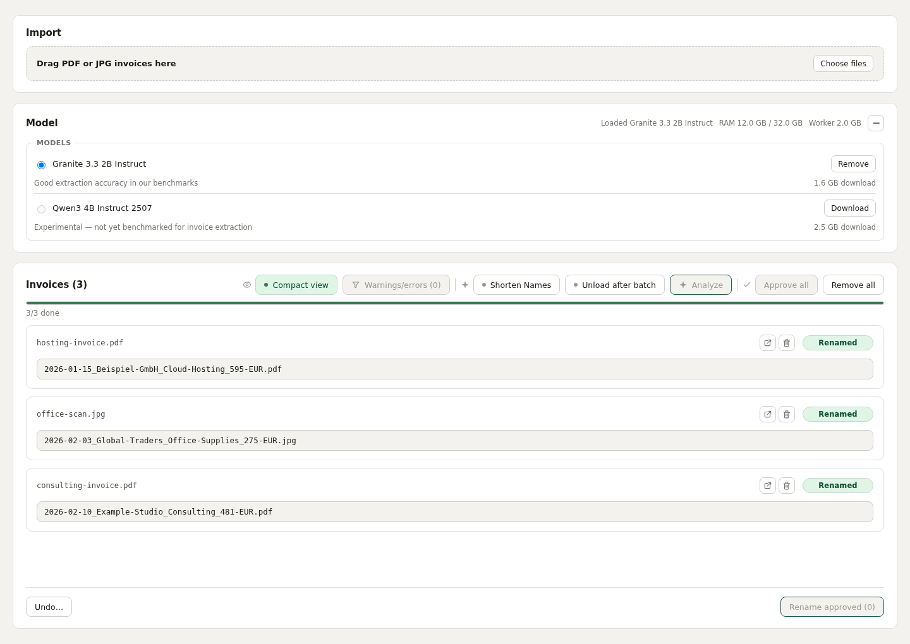

# Invoice Renamer

Turn invoice filenames into something you can find again.

Invoice Renamer is a macOS and Linux desktop app that reads German and English invoices locally, proposes descriptive names, and lets you review them before renaming.

```text
hosting-invoice.pdf → 2026-01-15_Beispiel-GmbH_Cloud-Hosting_595-EUR.pdf
```

It combines embedded invoice XML, PDF text extraction, OCR, and a local
language model. Build it from source using the instructions below; there is
no ready-made app download.



*Screenshots show the actual frontend with synthetic demo data and simulated
worker/file operations.*

## How it works

1. **Import invoices.** Choose files or drag PDF/JPEG files into the window.
2. **Select a local model and analyze.** Download a model once, then process a
   batch or individual files. Documents run one at a time.
3. **Read the invoice.** For PDFs, the app first checks for supported embedded
   ZUGFeRD/Factur-X XML. Complete XML supplies the required fields directly.
   Otherwise, it reads PDF text and uses OCR on pages with too little text.
   JPEG images always go through OCR.
4. **Extract and propose.** A local llama.cpp model extracts fields from the
   text when needed. Valid XML fields take precedence over AI results. The app
   builds a filename from the date, seller, product, amount, and currency.
5. **Review and approve.** Inspect the extracted fields and warnings, edit the
   filename if needed, and approve the files you want to rename.
6. **Rename.** Apply approved names in the original folders. Document contents
   stay unchanged. Use Undo to reverse a recorded batch, or Redo to reapply the
   most recent undo during the same session.

Complete supported XML skips text extraction, OCR, and extraction inference.
Enabling **Shorten Names** still uses AI to shorten seller/product names.
The current interface requires an installed model even for XML-only invoices.

Proposed names follow `YYYY-MM-DD_Seller_Product_Amount-CURRENCY.pdf` or `.jpg`.
Amounts are rounded to whole currency units; the review view retains the precise
extracted amount. German umlauts are transliterated, unsafe characters are
removed, and the filename stem is limited to 150 characters. Missing fields use
placeholders and generate warnings. JPEG inputs, including `.jpeg`, get `.jpg`
proposals without converting the image.

## Supported files

| Input | Support |
|---|---|
| Text PDFs | Extracts text directly; OCR on pages with insufficient text |
| Scanned or mixed PDFs | OCR per page as needed |
| JPG / JPEG scans | OCR, including EXIF orientation and CMYK images |
| ZUGFeRD / Factur-X inside a PDF | CII D16B, EN16931/COMFORT profile |
| Other embedded XML profiles or unusable XML | Falls back to PDF text/OCR and AI |
| Standalone XML, PNG, TIFF, HEIC | Not supported |

Files are limited to **50 MiB** each, PDFs to **200 pages**, and JPEGs to
**8000 pixels per side**. Password-protected PDFs have no password-entry flow.
Long documents can exceed the model's context limit even within these file limits.
OCR is configured for German and English. Other languages may work but aren't tested.

## Using the interface

- **Import:** Choose files or drag them into the window. Removing an entry from
  the list does not delete the source file.
- **Model:** Download, select, or remove models. The status line shows model
  residency, system RAM used/total, worker memory, and GPU use when available.
- **Analyze:** Process pending invoices together, or use an individual row's
  Analyze/Re-Run button. **Shorten Names** is off by default; enable it before
  analysis for shorter seller/product names. **Unload after batch** releases
  model memory once that run finishes.
- **Review:** Turn off **Compact view** to see fields and **Run details**.
  **Warnings/errors** filters rows needing attention. The Open button opens the
  original document in your system viewer. Edit a proposed name directly.
- **Approve and rename:** Approve individual rows or use **Approve all**, then
  **Rename approved**. Check the names before renaming; OCR and the model can
  be wrong without a warning.



*The XML badges identify fields taken from the embedded invoice. Run details
shows the extraction source and work performed; AI calls can be inspected when present.*



*Renames happen only after approval and the explicit Rename action. Existing
names receive a numbered suffix instead of being overwritten. A batch can
partially succeed; each row reports its result.*

**Undo** lets you choose a recorded batch, including after restarting the app.
It verifies that the same file is still present and the original name is free.
Moved/replaced files, occupied names, or a failure to save history can prevent
Undo. **Redo** is available for the latest undo in the current session.

## Models and hardware

| Model | Download | Memory floor | Role |
|---|---|---|---|
| Granite 3.3 2B Instruct | About 1.55 GB | 8 GiB | Preferred default when installed |
| Qwen3 4B Instruct 2507 | About 2.51 GB | 16 GiB | Experimental; not yet benchmarked for invoice extraction |

Downloads include quantized GGUF weights and tokenizer assets. No model is
bundled or downloaded automatically. The app checks available disk space and
system memory. The memory floors are minimums, not speed guarantees.
Both models use a 16K-token context. CPU execution is supported; GPU acceleration
depends on the hardware and how the installed llama.cpp binding was built.

## Local processing and storage

Invoice analysis runs in a local Python worker; the app communicates with it over
loopback using a session token. The analysis path does not send invoices to a
cloud AI service. After setup and model download, inference uses local files.
Internet access is needed for dependency installation and Hugging Face model
downloads; model files are pinned and verified with SHA-256 hashes.

Models are stored under:

- macOS: `~/Library/Application Support/invoice-renamer/models`
- Linux: `~/.local/share/invoice-renamer/models`

Rename history is stored as `rename_history.json` in the application's data
directory and includes original/destination paths and file identity. Extracted
fields and model-call details are held in the session. Local diagnostic output
may contain invoice details, so review logs before sharing them.

## Build and run

### Prerequisites

- **Python 3.12+** and [uv](https://docs.astral.sh/uv/)
- **Node.js 20.19+ or 22.12+** and npm
- **Rust**, installed through [rustup](https://rustup.rs), and the Tauri CLI:
  `cargo install tauri-cli --version "^2.0.0" --locked`
- **macOS:** Xcode Command Line Tools (`xcode-select --install`). OCR uses the
  built-in Apple Vision framework; no separate OCR engine is needed.
- **Linux:** Tesseract with English/German data and the Tauri webview dependencies.
  On Debian/Ubuntu:

  ```bash
  sudo apt install tesseract-ocr tesseract-ocr-eng tesseract-ocr-deu \
    libwebkit2gtk-4.1-dev build-essential curl wget file \
    libssl-dev libayatana-appindicator3-dev librsvg2-dev
  ```

Windows is not a supported target.

### Run from source

From the repository root:

```bash
scripts/build_worker_sidecar.sh
npm --prefix app install
cargo tauri dev
```

On first launch, download and select a model in the Model section. Rebuild the
worker after changing backend Python code; `cargo tauri dev` does not rebuild it.
The worker must be built for the same platform and architecture as the app.

### Linux checkout shared with a Mac

When a Linux container and macOS use the same checkout, use the isolated Linux
workspace to avoid replacing the Mac's dependencies and worker binaries:

```bash
scripts/linux_workspace.sh . scripts/build_worker_sidecar.sh
scripts/linux_workspace.sh app npm install
scripts/linux_workspace.sh . cargo tauri dev
```

The wrapper mirrors sources into a Linux-local cache before each run. Re-run it
after edits; it does not live-sync, and a running command holds the mirror lock.
Use `scripts/linux_workspace.sh <directory> <command...>` for other Linux commands
against a shared checkout as well.

### Build a standalone macOS app

After building the worker and installing frontend dependencies:

```bash
scripts/build_macos_app.sh
```

Output: `src-tauri/target/release/bundle/macos/Invoice Renamer.app`.
The script inserts the worker with its required library/symlink layout, verifies
it, and signs the assembled bundle. Use this script instead of bare
`cargo tauri build`. A local build is not a notarized public release; macOS may
require you to right-click the app and choose Open on first launch.

Linux packages currently omit the worker; use `cargo tauri dev` on Linux.

## Why I built this

I wanted to learn how to run open models on my own machine and how to build a
desktop app instead of another website. My invoice folder needed tidying anyway.
The [development story](docs/DEVELOPMENT_STORY.md) covers how it went, including
the parts that took a second attempt.

## Licenses

Invoice Renamer's own source code is licensed under the [MIT License](LICENSE).
Copyright (c) 2026 Thomas Weckenmann.

This repository distributes source code only. Python, npm, and Rust dependencies
and the models are downloaded by whoever builds and runs the app, under their
own licenses, which are separate from the project's MIT license.

A locally built app bundles many of these dependencies (the Python runtime and
packages in the worker, Rust crates, the frontend bundle). If you redistribute
a built app, including all required third-party notices is your responsibility.
The [third-party notices](backend/THIRD-PARTY-LICENSES) shipped in the worker at
`_internal/THIRD-PARTY-LICENSES` cover only the macOS OCR additions (ocrmac,
pyobjc-core, pyobjc-framework-Vision, click); see the file for its libffi caveat.

| Model | License | Source |
| --- | --- | --- |
| Granite 3.3 2B Instruct | Apache 2.0 | [ibm-granite/granite-3.3-2b-instruct-GGUF](https://huggingface.co/ibm-granite/granite-3.3-2b-instruct-GGUF) by IBM |
| Qwen3 4B Instruct 2507 | Apache 2.0 | [unsloth/Qwen3-4B-Instruct-2507-GGUF](https://huggingface.co/unsloth/Qwen3-4B-Instruct-2507-GGUF), a quantization of [Qwen/Qwen3-4B-Instruct-2507](https://huggingface.co/Qwen/Qwen3-4B-Instruct-2507) |

Models are downloaded from Hugging Face at pinned revisions and are not bundled
with the app. Qwen's download includes its upstream `LICENSE` file; Granite's
license is stated on its model card.
